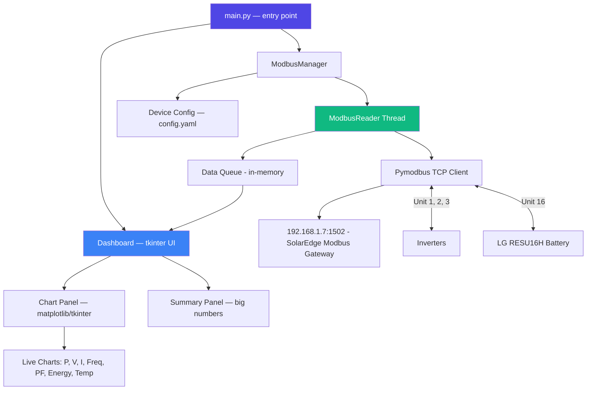
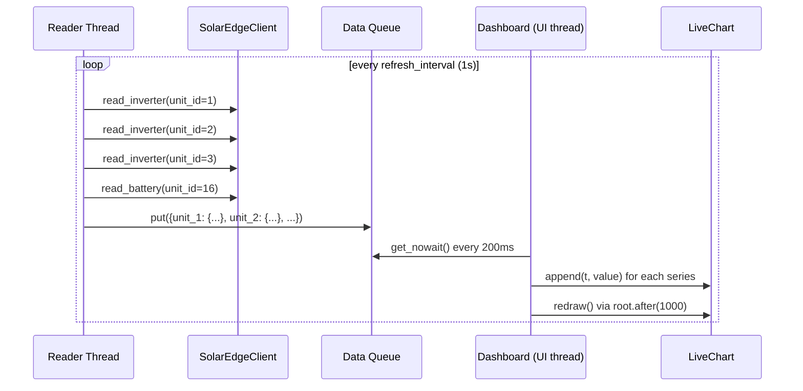

# solarView — Design Document

> *From the minds of IBM Bob & Daneyand*

## Overview

`solarView` is a desktop application that reads real-time Modbus TCP data from SolarEdge inverters and an LG RESU16H battery, displaying it in live-updating matplotlib charts embedded in a tkinter window. The design is intentionally minimal: no database, no network beyond the local Modbus gateway, no persistence — just a window that shows you exactly what's happening with your solar system *right now*.

## Architecture



### Key Design Principles

1. **Single responsibility per module** — `solaredge_modbus.client` owns protocol, `ui.charts` owns visualization, `ui.dashboard` owns layout
2. **Non-blocking UI** — Modbus reads happen on a background thread; data handoff via `queue.Queue`
3. **Graceful degradation** — if one inverter goes offline, others keep charting; UI shows disconnected state
4. **Configuration externalized** — `~/.solarview/config.yaml` with sensible defaults for 192.168.1.7 / unit IDs 1-3 + 16
5. **Cross-platform from day one** — tkinter + matplotlib ship everywhere Python does

## Module Design

### `solaredge_modbus/registers.py`

Pure data — defines the SolarEdge modbus register layout as a Python class/dict. No I/O, no pymodbus import.

```python
@dataclass
class Register:
    address: int
    name: str
    unit: str
    signed: bool
    is_uint64: bool = False  # for energy registers that span 2 registers

class InverterRegisters:
    AC_POWER = Register(40083, "AC_Power", "W", signed=True)
    AC_CURRENT_A = Register(40079, "AC_Current_A", "A", signed=False)
    AC_VOLTAGE_AN = Register(40076, "AC_Voltage_AN", "V", signed=False)
    AC_VOLTAGE_BN = Register(40079, "AC_Voltage_BN", "V", signed=False)
    AC_VOLTAGE_CN = Register(40081, "AC_Voltage_CN", "V", signed=False)
    AC_FREQUENCY = Register(40085, "AC_Frequency", "Hz", signed=False)
    AC_PF = Register(40091, "AC_PF", "%", signed=True)
    AC_ENERGY_WH = Register(40093, "AC_Energy_WH", "Wh", signed=True, is_uint64=True)
    HEATSINK_TEMP = Register(40103, "Heat_Sink_Temperature", "°C", signed=True)
    GRID_STATUS = Register(40113, "I_Grid_Status", "enum", signed=False)

class BatteryRegisters:
    B_DC_POWER = Register(57716, "B_DC_Power", "W", signed=True)
    B_DC_VOLTAGE = Register(57712, "B_DC_Voltage", "V", signed=False)
    B_DC_CURRENT = Register(57714, "B_DC_Current", "A", signed=False)
    B_SOE = Register(57732, "B_SOE", "%", signed=False)
    B_SOH = Register(57730, "B_SOH", "%", signed=False)
    B_EXPORT_ENERGY = Register(57718, "B_Export_Energy_WH", "Wh", signed=False, is_uint64=True)
    B_IMPORT_ENERGY = Register(57722, "B_Import_Energy_WH", "Wh", signed=False, is_uint64=True)
```

### `solaredge_modbus/client.py`

Owns the pymodbus connection and register decoding. Reads a batch of registers from a given unit ID in one Modbus transaction.

```python
class SolarEdgeClient:
    def __init__(self, host: str, port: int = 1502, timeout: float = 5.0): ...
    def connect(self) -> None: ...          # lazy TCP connect, retries=1
    def read_inverter(self, unit_id: int) -> dict: ...   # reads SolarEdge extended block
    def read_battery(self, unit_id: int = 16) -> dict: ...  # reads BatteryData block
    def close(self) -> None: ...
```

**Modbus framing notes (verified via smoke test):**
- SolarEdge modbus gateway listens on **port 1502** (not the standard port 80)
- SolarEdge responds to **FC3 (read holding registers)**, NOT FC4 (read input registers)
- The SunSpec header ("SunS") is at address 0, then SolarEdge's extended model (DID=1) follows
- Inverter data registers are at addresses 40069-40120 (0-based: 68-119)
- **Scale factor (SF) registers precede** the data registers — e.g., `AC_Power=40084` has its SF at `40082`
- Signed 16-bit values must be sign-extended (0x8000 → -32768 = "not available")
- uint32 energy registers use big-endian word order (high word first)
- Float32 battery values use little-endian word order (low word in first register)

### `ui/charts.py`

A `LiveChart` class that wraps a matplotlib `Figure` + `FigureCanvasTkAgg` for embedding in tkinter.

```python
class LiveChart:
    def __init__(self, parent, title: str, ylabel: str, maxlen: int = 120): ...
    def append(self, timestamp: float, value: float) -> None: ...  # thread-safe
    def redraw(self) -> None: ...  # called on UI tick
```

**Thread safety:** `append()` acquires a lock and appends to a `deque`; `redraw()` (called from tkinter `after()` callback) reads the deque under the same lock. No cross-thread matplotlib calls.

### `ui/dashboard.py`

The main tkinter window. Lays out 2×3 grid of charts + a summary panel. Uses `asyncio`-free polling: a background thread reads modbus → enqueues data; the UI loops on `root.after(1000, ...)` to dequeue + redraw.

```python
class Dashboard(tk.Tk):
    def __init__(self, modbus_manager: ModbusManager, config: dict): ...
    def _on_tick(self): ...  # dequeue data, update charts + summary
    def _on_closing(self): ...  # clean shutdown

class ModbusManager:
    def __init__(self, config: dict): ...
    def start(self): ...   # starts reader thread
    def stop(self): ...    # joins reader thread
    def latest_data(self) -> dict: ...  # returns most recent read results
```

### `config/default.yaml`

```yaml
inverter:
  host: "192.168.1.7"
  port: 1502
  units: [1, 2, 3]
  timeout: 5.0

battery:
  unit_id: 16
  host: "192.168.1.7"

ui:
  refresh_interval_seconds: 1.0
  chart_max_points: 120  # 2 minutes of data at 1s
```

## Data Flow



## Cross-Platform Considerations

| Concern | Solution |
|---|---|
| macOS native menu bar | `tk.call('tk', 'mac', 'reddebut', ...)` — sets app menu correctly when packaged |
| Windows executable | `pyinstaller --onefile --windowed main.py` |
| Linux deployment | `--onefile` + AppImage optionally |
| Python on macOS | Bundle Tcl/Tk via pyinstaller; system Python 3.12+ works fine |
| Font rendering | matplotlib's Agg backend handles cross-platform text rendering |

## Packaging

`pyinstaller --onefile --windowed --icon=icons/solarview.icns main.py` produces:
- macOS: `solarView.app` (double-clickable, shows in Dock)
- Windows: `solarView.exe`
- Linux: `solarView` (ELF binary)

The `.spec` file includes:
- Hidden imports: `matplotlib.backends.backend_tkagg`, `pymodbus`
- Data files: `config/default.yaml`, `icons/`
- `argv_emulation = True` (macOS) for future CLI flag support

## Failure Modes

| Scenario | Behavior |
|---|---|
| Inverter unreachable | Data point for that unit shows as `null` / chart gap; UI flashes "⚠ Inverter 2: Connection lost"; other charts continue |
| Modbus timeout | Reader thread retries with 2s backoff; if 3 consecutive timeouts, marks unit as offline |
| Battery unit ID wrong | Startup log prints "Battery not found at unit 16, scan suggested"; app still runs with inverter data only |
| Window closed while reading | `ModbusManager.stop()` joins reader thread; Tkinter destroy is clean |
